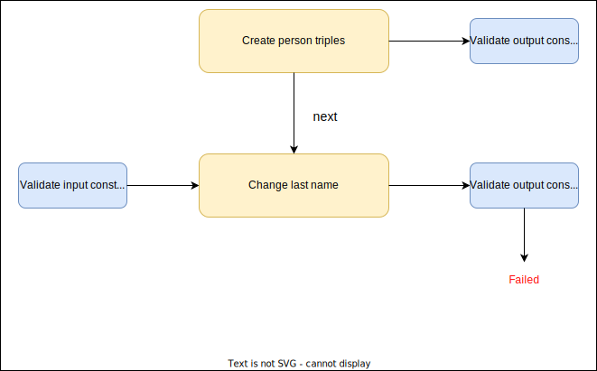

# Constraint validation example

The following text explains how SPipes module inputs and outputs can be checked by validation constraints.

## Introduction
This document is focused mainly on constraint validation, but you can take a look at [hello-world-example](https://github.com/kbss-cvut/s-pipes/blob/main/doc/examples/hello-world/hello-world.md) for more details about script construction and execution.

## Definition of validation constraints
Each SPipes module can have any number of validation constraints on its input (see `kbss:has-input-graph-constraint`) and its output (see `kbss:has-output-graph-constraint`). Each validation constraint is a SPARQL query. Currently, we support 2 types of queries:
* `ASK` -- returns true if validation constraint is violated. The template of the query looks like this:
```
 a sp:Ask ;
  sp:text """# SOME_COMMENT_IN_FIRST_LINE_TO_SHOW_WHEN_QUERY_FIRES
   
    ASK
    WHERE{
       # graph patterns to match
  }""" ;
```
    
* `SELECT` -- returns non-empty variable bindings if validation constraint is violated. The variable binding should be used to exemplify/explain what particular entities are violating the constraint. The template of the query looks like this:
```
 a sp:Select ;
  sp:text """# SOME_COMMENT_IN_FIRST_LINE_TO_SHOW_WHEN_QUERY_FIRES
   
    SELECT * # here we should use rather variables that explains the results
    WHERE{
       # graph patterns to match
  }""" ;
```


## Example

Let's imagine that we have database of people and a function `retrieve-person` that returns a person if its `firstName`, `lastName` or both are provided.

### Definition of the pipeline

1) First, we import the database from a [file](./people.ttl) with ontology iri `http://onto.fel.cvut.cz/ontologies/s-pipes/examples/constraint-validation/people`. Database contains two  people "Pavel Hnizdo" and "Petr Hnizdo".

```
:import-person-database
  a sml:ImportRDFFromWorkspace ;
  sm:next :construct-matched-person ;
  sml:baseURI "http://onto.fel.cvut.cz/ontologies/s-pipes/examples/constraint-validation/people" ;
  sml:ignoreImports true ;
.
```

2) Afterwards we validate that every person has first name and last name and that each person is at least 18 years old.

```
kbss:has-output-graph-constraint [
  a sp:Ask ;
  sp:text """# There is a person whose name is not complete
    PREFIX foaf: <http://xmlns.com/foaf/0.1/>

    ASK
    WHERE{
      ?person a foaf:Person .
      OPTIONAL { ?person foaf:lastName ?pFirstName }
      OPTIONAL { ?person foaf:firstName ?pLastName }
      FILTER(
          (! bound(?pFirstName))
          || (! bound(?pLastName))
      )
  }""" ;
];
```

```
kbss:has-output-graph-constraint [
    a sp:Select ;
    sp:text """# Person is not at least 18 years old
       PREFIX foaf: <http://xmlns.com/foaf/0.1/>
        ASK WHERE {
            ?person foaf:age ?age .
            FILTER (?age < 18) .
        }""" ;
  ];
```


3) We create another constraint which checks if the retrieved person is unique.

```
kbss:has-input-graph-constraint [ 
  a sp:Select ; 
  sp:text """# More than one person matches input parameters
    PREFIX foaf: <http://xmlns.com/foaf/0.1/>

    SELECT ?person ?lastName ?firstName ?pCount
    WHERE { 
      { 
        SELECT (count(distinct ?p) as ?pCount) 
        WHERE { 
           ?p a foaf:Person;
              foaf:firstName ?firstName;
              foaf:lastName ?lastName;
          . 
        } 
      } 
  
      FILTER(?pCount > 1)  
  
      ?person a foaf:Person;
         foaf:lastName ?lastName;
         foaf:firstName ?firstName;
      .  
  }""" ; 
];
 ```
 
 4) Finally, we retrieve people that match `firstName`, `lastName` variables. Note, that partial match is also possible.
 
 ```
 :construct-matched-person
  a sml:ApplyConstruct ;
  sm:next :retrieve-person_Return;
  sml:constructQuery [
      a sp:Construct ;
      sp:text """
      PREFIX foaf: <http://xmlns.com/foaf/0.1/>

      CONSTRUCT {
	      ?s ?p ?o .
      } WHERE {
        ?s a foaf:Person;
           foaf:lastName ?lastName;
           foaf:firstName ?firstName;
        .
	      ?s ?p ?o .
      }""" ;
    ] ;
  sml:replace true ;
  rdfs:label "Retrieve matched person" ;
.
```

The final script [constraint-validation.sms.ttl](constraint-validation.sms.ttl) can be visualized as follows:


 
### Execution of the pipeline
 
Now our pipeline is prepared, and we can run pipeline.
1) First, we check if 'Pavel Hnizdo' is in our database. We call following GET request and find out that both constraints are validated.
```
http://localhost:8080/s-pipes/service?_pId=retrieve-person&firstName=Pavel&lastName=Hnizdo
```

We see following messages in the log:
```
24-03-2022 09:37:44.547 [http-nio-8080-exec-19] DEBUG c.c.s.modules.AbstractModule - Constraint validated for exception "Person is not at least 18 years old".
24-03-2022 09:37:44.547 [http-nio-8080-exec-19] DEBUG c.c.s.modules.AbstractModule - Constraint validated for exception "There is a person whose name is not complete".
24-03-2022 09:37:44.547 [http-nio-8080-exec-15] DEBUG c.c.s.modules.AbstractModule - Constraint validated for exception "More than one person matches input parameters".
```


And we retrieve following answer:
```
{
  "@id" : "http://onto.fel.cvut.cz/ontologies/s-pipes/examples/constraint-validation/people/person-1",
  "@type" : "foaf:Person",
  "foaf:age" : 25,
  "firstName" : "Pavel",
  "lastName" : "Hnizdo",
  "@context" : {
    "firstName" : {
      "@id" : "http://xmlns.com/foaf/0.1/firstName"
    },
    "lastName" : {
      "@id" : "http://xmlns.com/foaf/0.1/lastName"
    },
    "age" : {
      "@id" : "http://xmlns.com/foaf/0.1/age",
      "@type" : "http://www.w3.org/2001/XMLSchema#integer"
    },
    "@vocab" : "http://onto.fel.cvut.cz/ontologies/s-pipes/constraint-validation/",
  }
}
```

2) Second, we check if 'Pavel' is in our database. We call following GET request, and we retrieve same results because there is only one "Pavel" in the database.
```
http://localhost:8080/s-pipes/service?_pId=retrieve-person&firstName=Pavel
```


2) Second, we check if person with lastname 'Hnizdo' is in our database. We call following GET request, but we find out that one of the constraints is failed.

```
http://localhost:8080/s-pipes/service?_pId=retrieve-person&lastName=Hnizdo
```
Pipeline execution validation constraint fails with message 'More than one person matches input parameters.' because 'Hnizdo' is in our database twice, once as Peter and once as Pavel.

We see following messages in logs:
```
Validation of constraint failed for the constraint: More than one person matches input parameters
"Failed validation constraint :
# More than one person matches input parameters
        PREFIX foaf: <http://xmlns.com/foaf/0.1/>

        SELECT ?person ?lastName ?firstName
        WHERE {
          {
            SELECT (count(distinct ?p) as ?pCount)
            WHERE {
               ?p a foaf:Person;
                  foaf:firstName ?firstName;
                  foaf:lastName ?lastName;
              .
            }
          }

          FILTER(?pCount > 1)

          ?person a foaf:Person;
             foaf:lastName ?lastName;
             foaf:firstName ?firstName;
          .
      }
Evidences:
| person                                                                                    | firstName |
+-------------------------------------------------------------------------------------------+-----------+
| http://onto.fel.cvut.cz/ontologies/s-pipes/examples/constraint-validation/people/person-2 | Peter     |
| http://onto.fel.cvut.cz/ontologies/s-pipes/examples/constraint-validation/people/person-1 | Pavel     |
```

If `execution.exitOnError` is set to `true` in `config-core.properties` , the pipeline will not proceed with execution, and an Error Validation Response in JSON-LD will be retrieved:
```
{
    "@id": "_:b1",
    "@type": "s-pipes:ValidationConstraintError",
    "constraintFailureEvidences": [
        {
            "@id": "_:b0",
            "firstName": "Peter",
            "person": {
                "@id": "s-pipes:examples/constraint-validation/people/person-2"
            }
        },
        {
            "@id": "_:b2",
            "firstName": "Pavel",
            "person": {
                "@id": "s-pipes:examples/constraint-validation/people/person-1"
            }
        }
    ],
    "constraintQuery": "# More than one person matches input parameters\n        PREFIX foaf: <http://xmlns.com/foaf/0.1/>\n\n        SELECT ?person ?lastName ?firstName\n        WHERE {\n          {\n            SELECT (count(distinct ?p) as ?pCount)\n            WHERE {\n               ?p a foaf:Person;\n                  foaf:firstName ?firstName;\n                  foaf:lastName ?lastName;\n              .\n            }\n          }\n\n          FILTER(?pCount > 1)\n\n          ?person a foaf:Person;\n             foaf:lastName ?lastName;\n             foaf:firstName ?firstName;\n          .\n      }",
    "message": "More than one person matches input parameters",
    "module": "http://onto.fel.cvut.cz/ontologies/s-pipes/constraint-validation/construct-matched-person",
    "@context": {
        "module": "http://onto.fel.cvut.cz/ontologies/s-pipes/module",
        "message": "http://onto.fel.cvut.cz/ontologies/s-pipes/message",
        "constraintFailureEvidences": {
            "@id": "http://onto.fel.cvut.cz/ontologies/s-pipes/constraintFailureEvidences",
            "@container": "@list"
        },
        "constraintQuery": "http://onto.fel.cvut.cz/ontologies/s-pipes/constraintQuery",
        "person": {
            "@id": "http://onto.fel.cvut.cz/ontologies/s-pipes/person"
        },
        "firstName": {
            "@id": "http://onto.fel.cvut.cz/ontologies/s-pipes/firstName"
        },
        "s-pipes": "http://onto.fel.cvut.cz/ontologies/s-pipes/"
    }
}
```


### Additional options to execute

As can be seen above, assuming that SPipes web application is running at `http://localhost:8080/s-pipes`. We can call the *pipeline* with:
```
http://localhost:8080/s-pipes/service?_pId=retrieve-person&firstName=$ARGUMENT1&lastName=$ARGUMENT2
```
where `$ARGUMENT1` is first name and `$ARGUMENT2` is last name of a person we want to retrieve from the database.

Moreover, we can specify following properties in `config-core.properties` to fine-tune behaviour w.r.t. validation constrains:
* `execution.checkValidationContraint` -- enables constraint validation check (true|false)
* `execution.exitOnError` -- whole pipeline fails when validation constraint fails  (true|false)

