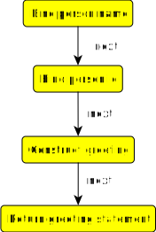

# Hello world example

Hello world example explains SPipes script construction, execution, and execution history tracking.

## Introduction

We create simple *script* that contain only one *pipeline*. The *pipeline* constructs hello world message for a person within RDF language. The person is identified by *pipeline*'s *input parameter*s `?firstName` and `?lastName`. 
Output of the pipeline in RDF for `?firstName=Robert` and `?lastName=Plant` is 

    <http://onto.fel.cvut.cz/ontologies/s-pipes/hello-world-example-0.1/Robert-Plant> <http://onto.fel.cvut.cz/ontologies/s-pipes/hello-world-example-0.1/is-greeted-by-message> "Hello Robert Plant." .

Our pipeline however returns the message in JSON-LD serialization of this RDF, which is

    {
        "@id" : "http://onto.fel.cvut.cz/ontologies/s-pipes/hello-world-example-0.1/Robert-Plant",
        "is-greeted-by-message" : "Hello Robert Plant.",
        
        "@context" : {
            "is-greeted-by-message" : {
                "@id" : "http://onto.fel.cvut.cz/ontologies/s-pipes/hello-world-example-0.1/is-greeted-by-message"
            },
            "@vocab" : "http://onto.fel.cvut.cz/ontologies/s-pipes/hello-world-example-0.1/",
        }
    }

## Script construction

Following steps are required to create hello world script:
1) Create *global script* file -- we name the script `hello-world.sms.ttl`. The suffix `.sms.ttl` makes all functions within the script global and thus executable from SPipes Web module using REST endpoint `/service`.
2) Create new ontology with SPipes dependencies -- all scripts must import SPipes library.
    ```
   @prefix :      <http://onto.fel.cvut.cz/ontologies/s-pipes/hello-world-example-0.1/> .
   
   <http://onto.fel.cvut.cz/ontologies/s-pipes/hello-world-example-0.1>
        a            owl:Ontology ;
        owl:imports  <http://onto.fel.cvut.cz/ontologies/s-pipes-lib> .
    ```
3) Add output function -- let's call it `execute-greeting` and make sure that it returns JSON-LD as serialization
of constructed RDF.  
    ```
    :express-greeting_Return
        a                  sml:ReturnRDF ;
        rdfs:label         "Return greeting statement" ;
        sml:serialization  sml:JSONLD .

    :execute-greeting  a     sm:Function ;
        rdfs:subClassOf  sm:Functions ;
        sm:returnModule  :express-greeting_Return .
   ```
4) Process input parameters -- we create two variables `?personName` and `?personId` using [SPARQL expressions](https://www.w3.org/TR/sparql11-query/). First, we bind *variable* `?personName` with expression `CONCAT(?firstName, " ", ?lastName)`, then we bind *variable* `?personId` with expression `REPLACE(LCASE(?personName), " ", "-")`. Second assignment must follow the first assignment which is expressed by `sm:next` property.
    ```
    :bind-person-name
        a sml:BindWithConstant ;
        sm:next :bind-person-id ;
        sm:outputVariable "personName" ;
        sml:value [
            a sp:concat ;
            sp:arg1 [
                sp:varName "firstName" ;
            ] ;
            sp:arg2 " " ;
            sp:arg3 [
                sp:varName "lastName" ;
            ] ;
        ] ;
        rdfs:label "Bind person name" ;
    .
    :bind-person-id
        a sml:BindWithConstant ;
        sm:next :construct-greeting ;
        sm:outputVariable "personId" ;
        sml:value [
            a sp:replace ;
            sp:arg1 [
                a sp:lcase ;
                sp:arg1 [
                    sp:varName "personName" ;
                ] ;
            ] ;
            sp:arg2 " " ;
            sp:arg3 "-" ;
        ] ;
        rdfs:label "Bind person id" ;
    .
    ```
5) Construct RDF triples -- finally, we construct RDF triples using SPARQL construct query. 
    ```
    :construct-greeting
        a sml:ApplyConstruct ;
        sm:next :express-greeting_Return ;
        sml:constructQuery [
            a sp:Construct ;
            sp:text """
                PREFIX : <http://onto.fel.cvut.cz/ontologies/s-pipes/hello-world-example-0.1/>
                CONSTRUCT {
                    ?person :is-greeted-by-message ?greetingMessage .
                } WHERE {
                    BIND(iri(concat(str(:), ?personId)) as ?person)
                    BIND(concat("Hello ", ?personName, ".") as ?greetingMessage)
                }
            """ ;
        ] ;
        sml:replace true ;
        rdfs:label "Construct greeting" ;
    .
   ```

The final script [hello-world.sms.ttl](hello-world.sms.ttl) can be visualized as follows:

 . 

## Script execution

Execution of the pipeline requires to configure location of scripts in variable `contexts.scriptPaths` of file `config-core.properties`. Two directories must be referenced there. First, directory that contains the script  
i.e. `$THIS_PROJECT_ROOT/doc/examples/hello-world`. Second, the directory that contains SPipes libraries 
i.e. root directory of the project [s-pipes-modules](https://kbss.felk.cvut.cz/gitblit/summary/s-pipes-modules.git) (Note! : it is different project not a sub-directory of this project).

Let's assume that SPipes web application is running at `http://localhost:8080/s-pipes`. We can call the *pipeline* with:
    
    http://localhost:8080/s-pipes/service?id=execute-greeting&firstName=Robert&lastName=Plant

The call produces log file as shown bellow:
    
    INFO  c.c.s.r.SPipesServiceController - Processing service GET request.
    INFO  c.c.s.r.SPipesServiceController - - parameters={id=[execute-greeting], firstName=[Robert], lastName=[Plant]}
    DEBUG c.c.s.r.SPipesServiceController - Parameter 'id' is used instead of parameter '_pId', which is missing.
    INFO  c.c.s.r.SPipesServiceController - - _pId=execute-greeting
    INFO  c.c.s.r.SPipesServiceController - - input variable binding ={_pId=execute-greeting, firstName=Robert, lastName=Plant}
    DEBUG c.c.s.util.JenaPipelineUtils - Registering function http://onto.fel.cvut.cz/ontologies/s-pipes/hello-world-example-0.1/execute-greeting 
        to return module http://onto.fel.cvut.cz/ontologies/s-pipes/hello-world-example-0.1/express-greeting_Return.
    INFO  c.c.s.e.ExecutionEngineImpl - Executing script http://onto.fel.cvut.cz/ontologies/s-pipes/hello-world-example-0.1/express-greeting_Return 
        with context Context 1326017910[ 
            varBindings = {_pId=execute-greeting, firstName=Robert, lastName=Plant}
	        modelSize = 0
	    ].
    INFO  c.c.s.e.ExecutionEngineImpl -  ##### Bind person name
    DEBUG c.c.s.m.BindWithConstantModule - 	Binding personName --> Robert Plant
    INFO  c.c.s.e.ExecutionEngineImpl -  ##### Bind person id 
    DEBUG c.c.s.m.BindWithConstantModule - 	Binding personId --> robert-plant
    INFO  c.c.s.e.ExecutionEngineImpl -  ##### Construct greeting
    INFO  c.c.s.e.ExecutionEngineImpl -  ##### Return greeting statement
    INFO  c.c.s.r.SPipesServiceController - Processing successfully finished.
    DEBUG c.c.s.c.RDFMediaTypeConverter - Writing model of size 1, message: {Content-Type=[application/ld+json;charset=utf-8]}

## Script execution history tracking

SPipes allows creating advance logs that can be used to retrieve information from history of execution of SPipes engines.
Execution is tracked by a progress listener which can be configured per each SPipes service call. We demonstrate it on  
advanced logging listener implemented in class `cz.cvut.spipes.logging.AdvancedLoggingProgressListener`.

The listener logs execution metadata into RDF4J repository that can be later used to query the execution history. 
Execution data are logged into filesystem directory. Let's assume that we have RDF4J server running at 
`http://localhost:8080/rdf4j-server` where we create a repository called `s-pipes-hello-world`. 
To configure the listener, we need to create a [ttl file](config.ttl) containing progress listener configuration :

    [
        a    spipes:progress-listener ;
        spipes:has-classname "cz.cvut.spipes.logging.AdvancedLoggingProgressListener" ;
        alpl:p-metadata-repository-name "s-pipes-hello-world" ;
        alpl:p-rdf4j-server-url "http://localhost:8080/rdf4j-server" ;
        alpl:p-execution-group-id "s-pipes-hello-world-testing" ;
    ] .
    
 The `p-execution-group-id` is an identifier that can be used to group executions when querying the RDF4J repository.
 
 To execute the hello world pipeline configured with the advanced logging listener run: 
    
    http://localhost:8080/s-pipes/service?id=execute-greeting&firstName=Robert&lastName=Plant&_pConfigURL=/SPIPES_DIR/doc/examples/hello-world/config.ttl

It deploys [execution metadata](rdf4j-repository-export.nq.zip) into RDF4J server as well as [directory with all data inputted to or outputted from modules](execution-logs.zip). 
