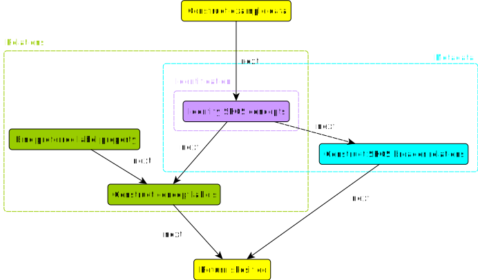

# Skosify OWL ontology example

This example demonstrates debugging capabilities of SPipes engine. Let's assume that SPipes web application 
is running at `http://localhost:8080/s-pipes`. Script [skosify.sms.ttl](skosify.sms.ttl) contains *pipeline* 
that can be called with:

    http://localhost:8080/s-pipes/service?id=skosify

The *pipeline* constructs sample OWL ontology about organisms and returns a SKOS view on that ontology. 
The script can be visualized as follows:

.

It has 3 ontology submodules: 
- [Identification](identification.ttl) - identifies SKOS concepts within OWL ontology.
- [Relations](relations.ttl) - constructs SKOS relations between provided SKOS concepts.
- [Metadata](metadata.ttl) - constructs SKOS metadata for provided SKOS concepts.

## Pipeline example data

"Construct example data" module constructs triples about organisms:
```
:organism a owl:Class ;
    rdfs:label "Organism" ;
.
:person a owl:Class ;
    rdfs:label "Person" ;
    rdfs:subClassOf :organism ;
.
:animal a owl:Class ;
    rdfs:label "Animal" ;
    rdfs:subClassOf :organism ;
.
:cat a owl:Class ;
    rdfs:label "Cat" ;
    rdfs:subClassOf :animal ;
.
:dog a owl:Class ;
    rdfs:label "Dog" ;
    rdfs:subClassOf :animal ;
.
:lassie-movie-star a owl:NamedIndividual ;
    rdfs:label "Lassie" ;
    a :dog ;
.
:laika-space-animal a owl:NamedIndividual ;
    rdfs:label "Laika" ;
    a :dog ;
.
```

## Pipeline output

The pipeline transforms provided data into [data represented by SKOS vocabulary](skosify-output.ttl).


# Debugging 

There is possibility to execute any module within the script separately using SPipes REST endpoint `/module`.